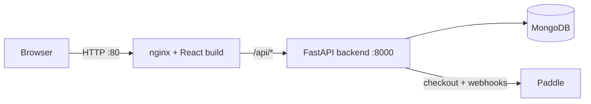
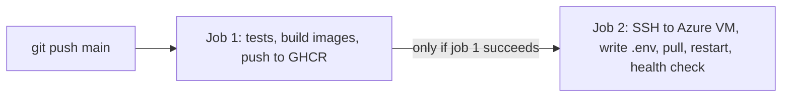

# Tavora POS

Multi-tenant point-of-sale SaaS for cafés, bars and restaurants: tables, orders,
kitchen and bar screens, products, daily reports and subscription billing.
UI available in Albanian, English and German.

## Tech stack

| Layer      | Technology                                   |
|------------|----------------------------------------------|
| Frontend   | React + Vite, i18next, served by nginx       |
| Backend    | FastAPI (Python 3.12), JWT auth              |
| Database   | MongoDB 7 (Motor async driver)               |
| Billing    | Paddle                                       |
| Containers | Docker, Docker Compose                       |
| CI/CD      | GitHub Actions, GitHub Container Registry    |
| Hosting    | Azure Virtual Machine                        |

## Architecture



nginx serves the React app and forwards every `/api/*` request to the backend,
so the browser only talks to one domain. Each container has a healthcheck and
starts only when the service it depends on is actually ready.

## CI/CD pipeline

One workflow (`.github/workflows/ci-cd.yml`) with two jobs:



## Run locally

```bash
docker compose up --build
```

- App: http://localhost:8081
- API docs: http://localhost:8000/docs
- Health: http://localhost:8000/api/health

Without Docker: copy `backend/.env.example` to `backend/.env`, run
`uvicorn app.main:app --reload` in `backend/`, and `npm run dev` in `frontend/`.

## Tests

Backend tests run automatically in CI on every push. Run them locally:

```bash
cd backend
pip install -r requirements-dev.txt
pytest -v
```

They cover default setup for new businesses (135 tables, 144 products with
stock 0, runs only once, data separated per business), JWT tokens and
forged-token rejection, and the production check for a strong secret.

## Deploy to an Azure VM

1. Create an Ubuntu VM, open port 80, install Docker and the Compose plugin.
2. Add these repository secrets in GitHub (Settings, Secrets and variables, Actions):
   `SSH_HOST`, `SSH_USERNAME`, `SSH_KEY` (private key),
   `JWT_SECRET_KEY` (`openssl rand -hex 32`), and optionally `CORS_ORIGINS`.
3. Push to `main`. Tests run, images are pushed to GHCR, and the VM is updated.
   The `.env` file on the VM is written from the secrets on every deploy,
   so a new VM only needs Docker installed and the three SSH secrets updated.

## Security notes

- `.env` files are never committed; only `.env.example` templates are.
- In production (`APP_ENV=production`) payment simulation and debug endpoints
  are disabled.
- MongoDB is not exposed to the internet in production.
